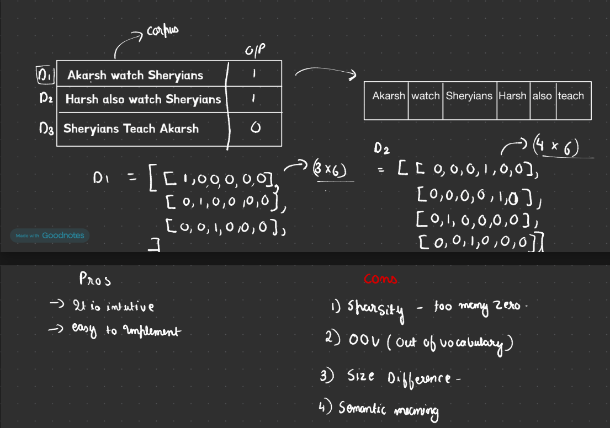

# Feature Extraction / Vectorization

Text is not numeric, but machine learning models work with numbers.
So we convert text into numeric representations. This process is called
**feature extraction** (or **vectorization**).

## Common Techniques

- One-Hot Encoding
- Bag of Words (BoW)
- TF-IDF
- Word2Vec
- BERT / Transformers

- **One-Hot Encoding**: Converts categories into 0/1 columns.
	- Example: `Color = Red` → `Red=1, Blue=0, Green=0`

- **Corpus**: A full collection of text data.
	- Example: 10,000 movie reviews used for training.

- **Document**: One single text item inside a corpus.
	- Example: one review like *"This movie was great"*.

- **Vocabulary**: Unique words found in the corpus.
	- Example: from `"I love NLP"` and `"I love ML"` → `{I, love, NLP, ML}`

- **Bag of Words (BoW)**: Converts each document into word-count numbers using the vocabulary.
	- Example:
		- Doc1: `"I love NLP"`
		- Doc2: `"I love love ML"`
		- Vocabulary: `[I, love, NLP, ML]`
		- Vectors: Doc1 → `[1, 1, 1, 0]`, Doc2 → `[1, 2, 0, 1]`

- **Unigram**: Single word token.
	- Example: "I love NLP" → `[I, love, NLP]`

- **Bigram**: Pair of consecutive words.
	- Example: "I love NLP" → `[I love, love NLP]`

- **N-gram**: Sequence of `n` consecutive words.
	- Example (`n=3`, trigram): "I love NLP today" → `[I love NLP, love NLP today]`

- **TF-IDF**: Gives higher weight to words that are important in one document but not common in all documents.
	- Example:
		- Corpus: `"the movie is good"`, `"the movie is bad"`
		- Word `movie` appears in both docs → lower TF-IDF
		- Word `good` appears in one doc → higher TF-IDF